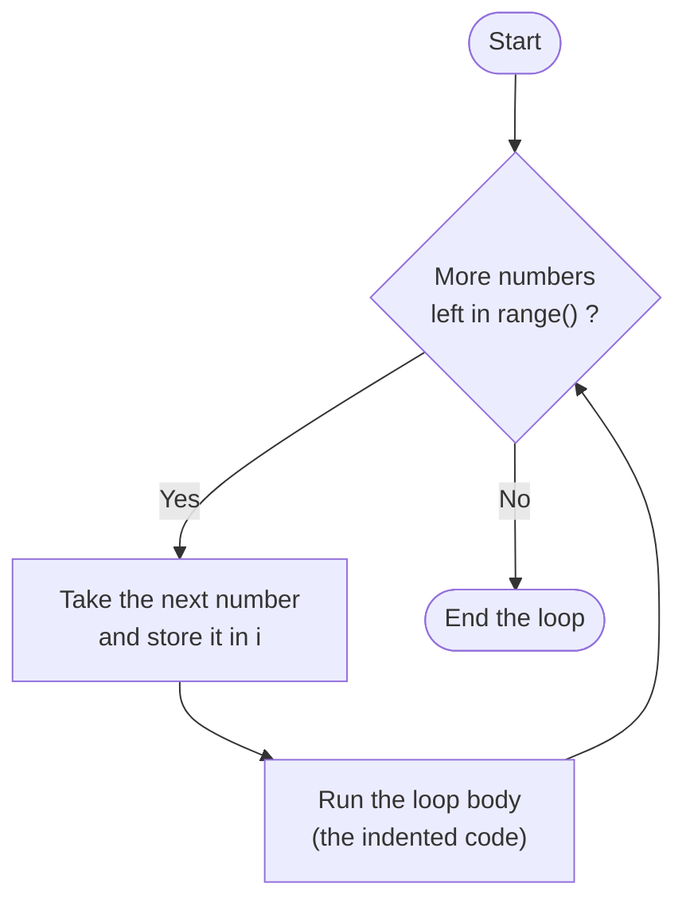

# Lesson 1: `for` Loops in Python

*Part of the **Loops in Python** series · Lesson 1 of 5*

> **Before you start:** This lesson assumes you're comfortable with variables, numbers, `print()`, `input()`, and conditional statements (`if` / `elif` / `else`). If conditionals are still shaky, review that lesson first — loops build directly on them.

---

## What You'll Learn

By the end of this lesson, you'll be able to:

- Explain what a loop is and why we need one
- Use a `for` loop to repeat an action a set number of times
- Control counting with `range()` — start, stop, and step
- **Trace** a loop by hand to predict exactly what it prints
- Avoid the most common `for` loop mistakes

---

## 1. Why Do We Need Loops?

Imagine you want to print the numbers 1 to 5. You *could* write:

```python
print(1)
print(2)
print(3)
print(4)
print(5)
```

That works... but what if you needed 1 to 1000? Copying lines is slow, error-prone, and impossible for large amounts. Computers are brilliant at doing the same thing over and over, and **loops** are how we ask them to.

A `for` loop lets us write the action **once** and tell Python how many times to repeat it.

```python
for number in range(1, 6):
    print(number)
```

**Output:**
```
1
2
3
4
5
```

Five lines of work, written in two. That's the power of a loop.

---

## 2. The `for` Loop and `range()`

### The shape of a `for` loop

```python
for variable in range(...):
    # the indented body runs once for each number
    do_something(variable)
```

Things to notice:

1. The line starts with `for` and ends with a **colon** `:`
2. `variable` is a name *you* choose — it holds a new value on each pass (commonly `i`, short for "index")
3. The body is **indented** (4 spaces), exactly like the body of an `if`
4. `range(...)` decides which numbers the loop walks through

### Understanding `range()`

`range()` is a number generator. It comes in three forms:

| Form | Produces | Example | Numbers |
|------|----------|---------|---------|
| `range(stop)` | 0 up to (not including) stop | `range(5)` | 0, 1, 2, 3, 4 |
| `range(start, stop)` | start up to (not including) stop | `range(2, 6)` | 2, 3, 4, 5 |
| `range(start, stop, step)` | start to stop, counting by step | `range(1, 10, 2)` | 1, 3, 5, 7, 9 |

> **The golden rule of `range()`:** it **stops *before*** the stop value — it never includes it. `range(1, 5)` gives you `1, 2, 3, 4`, **not** 5. This trips up almost every beginner, so keep it front of mind.

To loop from 1 to 5 *inclusive*, you ask for `range(1, 6)` — one past where you want to end.

---

## 3. Walkthrough: Tracing a Loop Step by Step

The best way to truly understand a loop is to **trace** it — pretend you're the computer and write down what happens on each pass. Let's trace this loop:

```python
for i in range(1, 4):
    print(i * 2)
```

`range(1, 4)` produces `1, 2, 3`, so the body runs **three times**. Here's the trace:

| Pass | `i` | `i * 2` | What prints |
|------|-----|---------|-------------|
| 1    | 1   | 2       | `2`         |
| 2    | 2   | 4       | `4`         |
| 3    | 3   | 6       | `6`         |

**Output:**
```
2
4
6
```

Reading the table row by row *is* running the loop. After the last number (3) is used, `range` has nothing left, so the loop ends.

### Tracing an accumulator

Here's a slightly trickier one. We keep a running total in a variable called `total`, adding `i` to it each pass:

```python
total = 0
for i in range(1, 5):
    total = total + i
    print("After adding", i, "total is", total)
```

The key idea: `total` **survives between passes** — it remembers its value and keeps growing. Let's trace it:

| Pass | `i` | `total` before | `total + i` | `total` after |
|------|-----|----------------|-------------|---------------|
| 1    | 1   | 0              | 0 + 1       | 1             |
| 2    | 2   | 1              | 1 + 2       | 3             |
| 3    | 3   | 3              | 3 + 3       | 6             |
| 4    | 4   | 6              | 6 + 4       | 10            |

**Output:**
```
After adding 1 total is 1
After adding 2 total is 3
After adding 3 total is 6
After adding 4 total is 10
```

This "start at zero, add each time" idea is called the **accumulator pattern**, and you'll use it constantly. We'll meet it again later in the series.

---

## 4. Flowchart: How a `for` Loop Works

Every `for` loop follows the same cycle: check whether `range()` has another number, and if so, run the body and come back to check again. The arrow looping back is what makes it a *loop*.




Notice the loop only ends when `range()` runs out of numbers. The body never decides to stop on its own (we'll learn how to *force* an early stop with `break` in Lesson 3).

---

## 5. More Examples

### Repeating an action a fixed number of times

Sometimes you don't even need the loop variable — you just want something to happen N times.

```python
for i in range(3):
    print("Python is fun!")
```

**Output:**
```
Python is fun!
Python is fun!
Python is fun!
```

### Counting downwards with a negative step

A negative step makes the loop count **backwards**.

```python
for i in range(5, 0, -1):
    print(i)
print("Go!")
```

**Output:**
```
5
4
3
2
1
Go!
```

Here `range(5, 0, -1)` walks `5, 4, 3, 2, 1` and stops *before* 0.

### Stepping by a fixed amount

```python
for i in range(0, 21, 5):
    print(i)
```

**Output:**
```
0
5
10
15
20
```

---

## 6. Common Mistakes to Avoid

### Mistake 1: Expecting `range` to include the stop value

```python
# Goal: print 1 to 5
for i in range(1, 5):   # WRONG - this prints 1, 2, 3, 4
    print(i)

# CORRECT - go one past your target
for i in range(1, 6):
    print(i)
```

### Mistake 2: Forgetting the colon

```python
for i in range(5)      # SyntaxError - missing colon
    print(i)

# CORRECT
for i in range(5):
    print(i)
```

### Mistake 3: Wrong indentation

```python
# WRONG - body not indented
for i in range(5):
print(i)               # IndentationError

# CORRECT
for i in range(5):
    print(i)
```

### Mistake 4: A backwards range that produces nothing

```python
# WRONG - you can't count UP with the default step from 10 to 1
for i in range(10, 1):   # produces NOTHING, loop never runs
    print(i)

# CORRECT - to count down, use a negative step
for i in range(10, 1, -1):
    print(i)
```

> Why does `range(10, 1)` produce nothing? Because the default step is `+1`, and you can't reach a smaller number by going up. Python simply runs the loop zero times.

---

## 7. Quick Reference

```python
# Repeat N times
for i in range(N):
    ...

# Count from a to b inclusive
for i in range(a, b + 1):
    ...

# Count by a step
for i in range(start, stop, step):
    ...

# Count downwards
for i in range(start, stop, -1):
    ...

# Accumulator pattern
total = 0
for i in range(1, n + 1):
    total = total + i
```

---

## 8. Check Your Understanding (5 MCQs)

Try each one before checking the answer key below.

**Q1.** What does `range(5)` produce?
- A) `1, 2, 3, 4, 5`
- B) `0, 1, 2, 3, 4`
- C) `0, 1, 2, 3, 4, 5`
- D) `1, 2, 3, 4`

**Q2.** How many times does the body of this loop run?
```python
for i in range(2, 8):
    print(i)
```
- A) 8
- B) 5
- C) 6
- D) 7

**Q3.** What is the output?
```python
for i in range(1, 10, 3):
    print(i, end=" ")
```
- A) `1 4 7`
- B) `1 4 7 10`
- C) `1 3 6 9`
- D) `3 6 9`

**Q4.** Which `range()` produces the sequence `10, 8, 6, 4, 2`?
- A) `range(10, 2, -2)`
- B) `range(10, 1, -2)`
- C) `range(10, 0, 2)`
- D) `range(2, 10, 2)`

**Q5.** What does this code print?
```python
total = 0
for i in range(1, 5):
    total = total + i
print(total)
```
- A) `10`
- B) `4`
- C) `15`
- D) `5`

<details>
<summary><strong>Answer Key (tap to reveal)</strong></summary>

**Q1 — B.** `range(5)` starts at 0 and stops before 5, giving `0, 1, 2, 3, 4`.

**Q2 — C (6).** `range(2, 8)` is `2, 3, 4, 5, 6, 7` — that's 6 numbers. A quick trick: `stop - start` = `8 - 2` = 6.

**Q3 — A (`1 4 7`).** Starting at 1 and stepping by 3: `1, 4, 7`. The next value, 10, is not less than the stop value 10, so it's excluded.

**Q4 — B.** `range(10, 1, -2)` counts down by 2 and stops before 1, giving `10, 8, 6, 4, 2`. Option A stops before 2, so it loses the final 2 (`10, 8, 6, 4`).

**Q5 — A (`10`).** The accumulator adds `1 + 2 + 3 + 4` = 10. (Remember, `range(1, 5)` stops before 5.)

</details>

---

## 9. Coding Challenges (5 Problems)

Write and run each one yourself. Solutions follow — but try first!

**Problem 1 — Count to Ten.**
Print the numbers from 1 to 10, each on its own line.

**Problem 2 — Multiples of Seven.**
Print the first five multiples of 7 (that is: 7, 14, 21, 28, 35).

**Problem 3 — Sum to 100.**
Calculate and print the sum of all whole numbers from 1 to 100. (The answer should be a single number.)

**Problem 4 — Rocket Countdown.**
Print a countdown from 10 down to 1, each on its own line, then print `Blast off!`.

**Problem 5 — Even Numbers Up To N.**
Ask the user for a whole number `n`, then print every even number from 2 up to and including `n`.

<details>
<summary><strong>Solutions (tap to reveal)</strong></summary>

**Solution 1**
```python
for i in range(1, 11):
    print(i)
```

**Solution 2**
```python
for i in range(1, 6):
    print(7 * i)
```
*Alternative using a step:* `for i in range(7, 36, 7): print(i)`

**Solution 3**
```python
total = 0
for i in range(1, 101):
    total = total + i
print(total)   # 5050
```

**Solution 4**
```python
for i in range(10, 0, -1):
    print(i)
print("Blast off!")
```

**Solution 5**
```python
n = int(input("Enter a whole number: "))
for i in range(2, n + 1, 2):
    print(i)
```
*Note the `n + 1` so that `n` itself is included when it's even.*

</details>

---

## Summary

- A **`for` loop** repeats its indented body once for each number in `range()`.
- `range(stop)`, `range(start, stop)`, and `range(start, stop, step)` control the count — and `range` always **stops before** the stop value.
- Use a **negative step** to count downwards.
- **Tracing** a loop (writing down each pass in a table) is the surest way to predict its output.
- The **accumulator pattern** (start at 0, add each pass) builds up a running total.

Up next in **Lesson 2: `while` loops** — how to repeat code based on a *condition* rather than a fixed count.
