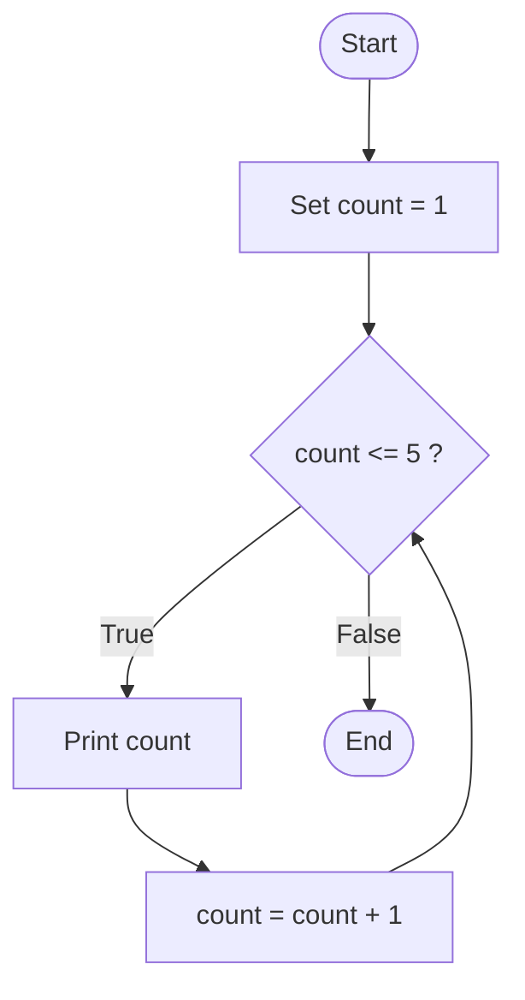

# Lesson 2: `while` Loops

*Part of the **Loops in Python** series · Lesson 2 of 5*

> **Before you start:** This lesson assumes you've done **Lesson 1 (`for` loops)** and **Lesson 1a (`range()`)**, plus variables, numbers, `print()`, `input()`, and comparisons. Type every example and run it.

---

## What You'll Learn

- The difference between a `for` loop and a `while` loop
- How to write a `while` loop that repeats **until a condition changes**
- The **three parts** every `while` loop needs to work
- How to read input until a "stop" value
- What an **infinite loop** is and how to avoid it

---

## 1. When You Don't Know How Many Times

A `for` loop is perfect when you know the count in advance — "repeat 10 times," "count from 1 to 5." But sometimes you *don't* know how many times you'll need to repeat:

- Keep doubling your savings *until* you reach a goal — how many years is that?
- Keep adding up numbers *until* the user is done — how many numbers will they enter?

In these cases you repeat **while** some condition is true, and stop the moment it becomes false. That's exactly what a `while` loop does.

---

## 2. The `while` Statement

```python
while condition:
    # this body repeats over and over WHILE condition is True
    body
```

Python checks the condition **before each pass**:

- If it's `True`, run the body, then check again.
- If it's `False`, stop and move on.

Here's a simple counter:

```python
count = 1
while count <= 5:
    print(count)
    count = count + 1
```

**Output:**
```
1
2
3
4
5
```

---

## 3. The Three Parts Every `while` Loop Needs

Look closely at that counter — it has three essential pieces:

```python
count = 1            # 1. INITIALISE a variable before the loop
while count <= 5:    # 2. a CONDITION to check each time
    print(count)
    count = count + 1   # 3. UPDATE the variable inside the loop
```

That third part is the one beginners forget. If `count` never changes, the condition `count <= 5` stays `True` forever — and the loop never stops. **Always make sure something inside the loop moves it closer to ending.**

---

## 4. Walkthrough: Tracing a `while` Loop

Let's trace the counter step by step. The key column is the last one — the **update** is what eventually ends the loop.

| Pass | `count` | `count <= 5`? | Prints | `count` after update |
|------|---------|---------------|--------|----------------------|
| 1    | 1       | True          | `1`    | 2                    |
| 2    | 2       | True          | `2`    | 3                    |
| 3    | 3       | True          | `3`    | 4                    |
| 4    | 4       | True          | `4`    | 5                    |
| 5    | 5       | True          | `5`    | 6                    |
| 6    | 6       | **False**     | —      | (loop ends)          |

On the sixth check, `count` is 6, so `6 <= 5` is `False` and the loop stops.

---

## 5. Flowchart: How a `while` Loop Works

A `while` loop is a cycle: check the condition, run the body, update, and loop back to check again. The arrow returning to the diamond is what makes it repeat.




---

## 6. `for` vs `while` — Which One?

Both can repeat, so when do you use each?

- Use a **`for`** loop when you know **how many times** (counting through a `range`).
- Use a **`while`** loop when you repeat **until a condition changes** and don't know the count ahead of time.

The same counting task, both ways:

```python
# for loop - you know it's 5 times
for count in range(1, 6):
    print(count)

# while loop - repeat as long as the condition holds
count = 1
while count <= 5:
    print(count)
    count = count + 1
```

For simple counting, `for` is shorter. `while` shines when the stopping point depends on something that happens *during* the loop.

---

## 7. Repeating Until a "Stop" Value

A common use of `while` is to keep reading numbers from the user until they enter a special **stop value** (here, 0):

```python
total = 0
number = int(input("Enter a number (0 to finish): "))
while number != 0:
    total = total + number
    number = int(input("Enter a number (0 to finish): "))
print("The total is:", total)
```

**Sample run:**
```
Enter a number (0 to finish): 5
Enter a number (0 to finish): 3
Enter a number (0 to finish): 2
Enter a number (0 to finish): 0
The total is: 10
```

The user could enter 2 numbers or 200 — a `while` loop handles either, because it keeps going until the stop value appears. (Notice we read one number *before* the loop and the next *at the end* of each pass.)

---

## 8. Infinite Loops (the #1 `while` Mistake)

If the condition never becomes false, the loop runs **forever**:

```python
count = 1
while count <= 5:
    print(count)
    # OOPS - we forgot "count = count + 1"
```

Because `count` stays 1, `count <= 5` is always `True`, so this prints `1` endlessly. If this happens to you, press **Ctrl + C** to stop the program.

To avoid it, always check: *does something inside the loop change the variable in the condition?* If not, the loop can never end.

---

## 9. Common Mistakes to Avoid

### Mistake 1: Forgetting to update the variable

```python
n = 1
while n <= 3:
    print(n)        # infinite loop - n never changes!

# CORRECT
n = 1
while n <= 3:
    print(n)
    n = n + 1
```

### Mistake 2: Updating in the wrong direction

```python
n = 5
while n > 0:
    print(n)
    n = n + 1       # n grows, so n > 0 is always true - infinite!

# CORRECT - move toward making the condition false
n = 5
while n > 0:
    print(n)
    n = n - 1
```

### Mistake 3: Forgetting the colon or the indentation

```python
while count <= 5     # SyntaxError - missing colon
    print(count)
```

---

## 10. Quick Reference

```python
# Basic shape
start_value = ...        # 1. initialise
while condition:         # 2. condition checked each pass
    body
    update_the_variable  # 3. update (so it eventually ends)

# Count up
n = 1
while n <= 10:
    print(n)
    n = n + 1

# Read until a stop value
x = int(input())
while x != 0:
    # use x
    x = int(input())
```

---

## 11. Check Your Understanding (5 MCQs)

**Q1.** How many times does this print `hi`?
```python
n = 1
while n <= 3:
    print("hi")
    n = n + 1
```
- A) 2
- B) 3
- C) 4
- D) Forever

**Q2.** What does this print?
```python
x = 10
while x > 6:
    print(x)
    x = x - 1
```
- A) `10 9 8 7`
- B) `10 9 8 7 6`
- C) `9 8 7 6`
- D) Forever

**Q3.** What happens here?
```python
count = 1
while count <= 5:
    print(count)
```
- A) Prints 1 to 5
- B) Prints nothing
- C) Prints `1` forever
- D) An error

**Q4.** What must change inside a `while` loop so it eventually stops?
- A) The `print` statement
- B) The variable used in the condition, so the condition becomes false
- C) The colon
- D) Nothing needs to change

**Q5.** What does this print?
```python
total = 0
n = 1
while n <= 4:
    total = total + n
    n = n + 1
print(total)
```
- A) `4`
- B) `10`
- C) `6`
- D) `0`

<details>
<summary><strong>Answer Key (tap to reveal)</strong></summary>

**Q1 — B (3).** The body runs for `n` = 1, 2, 3 — three times — then `n` becomes 4 and `4 <= 3` is false.

**Q2 — A (`10 9 8 7`).** It prints while `x > 6`: 10, 9, 8, 7. When `x` reaches 6, `6 > 6` is false, so 6 is not printed.

**Q3 — C (Prints `1` forever).** `count` is never updated, so `count <= 5` stays true and the loop is infinite.

**Q4 — B.** Something must change the condition's variable so the condition eventually becomes false; otherwise the loop never ends.

**Q5 — B (`10`).** It adds 1 + 2 + 3 + 4 = 10 (an accumulator built with a `while` loop).

</details>

---

## 12. Coding Challenges (5 Problems)

Write and **run** each one. Solutions follow — try first!

**Problem 1 — Count to Ten.**
Use a `while` loop to print the numbers from 1 to 10, each on its own line.

**Problem 2 — Countdown.**
Use a `while` loop to print a countdown from 5 down to 1, then print `Go!`.

**Problem 3 — Multiples of Three.**
Use a `while` loop to print the first five multiples of 3 (that is: 3, 6, 9, 12, 15).

**Problem 4 — Add Until Zero.**
Ask the user to enter numbers one at a time, keeping a running total. Stop when they enter `0`, then print the total.

**Problem 5 — Keep Doubling.**
Start with the value 1. Using a `while` loop, keep doubling it and printing each new value, stopping once the value goes above 100.

<details>
<summary><strong>Solutions (tap to reveal)</strong></summary>

**Solution 1**
```python
n = 1
while n <= 10:
    print(n)
    n = n + 1
```

**Solution 2**
```python
n = 5
while n > 0:
    print(n)
    n = n - 1
print("Go!")
```

**Solution 3**
```python
n = 3
while n <= 15:
    print(n)
    n = n + 3
```

**Solution 4**
```python
total = 0
number = int(input("Enter a number (0 to finish): "))
while number != 0:
    total = total + number
    number = int(input("Enter a number (0 to finish): "))
print("The total is:", total)
```

**Solution 5**
```python
value = 1
while value <= 100:
    value = value * 2
    print(value)
```

</details>

---

## Summary

- A **`while`** loop repeats its body **as long as a condition is true**, and stops when the condition becomes false.
- Every `while` loop needs three parts: **initialise** a variable, a **condition**, and an **update** inside the loop.
- Use `for` when you know the count; use `while` when you repeat **until** something changes.
- A `while` loop can read input **until a stop value** is entered.
- Forgetting to update the variable causes an **infinite loop** — always make sure the loop moves toward ending.

Next up — **Lesson 3: Controlling Loops** with `break`, `continue`, `pass`, and the loop `else`, which give you finer control over how loops start and stop.
