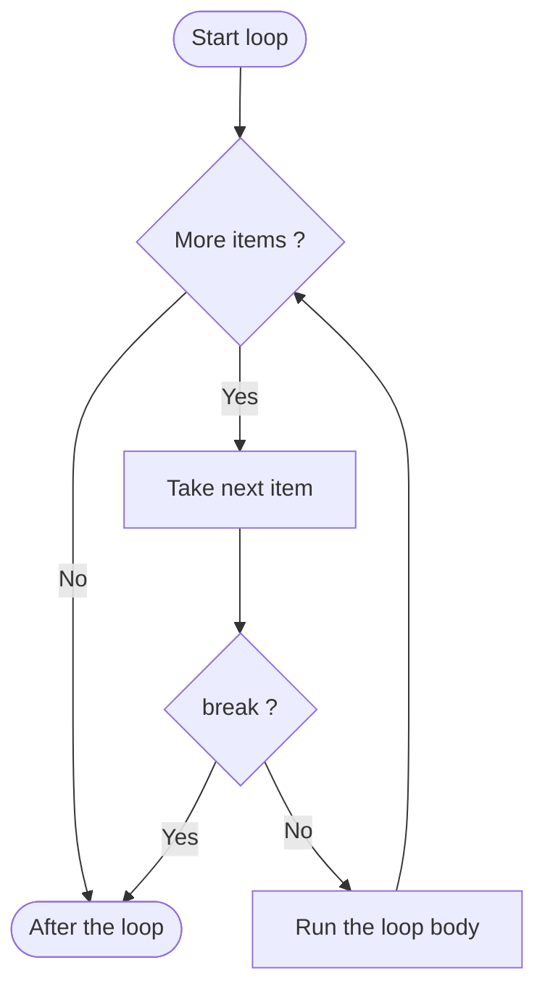
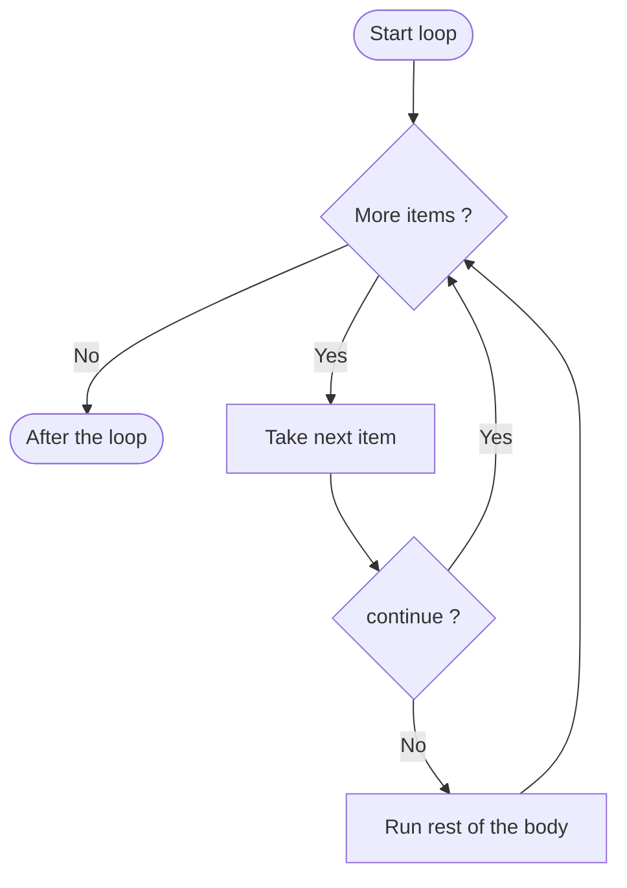
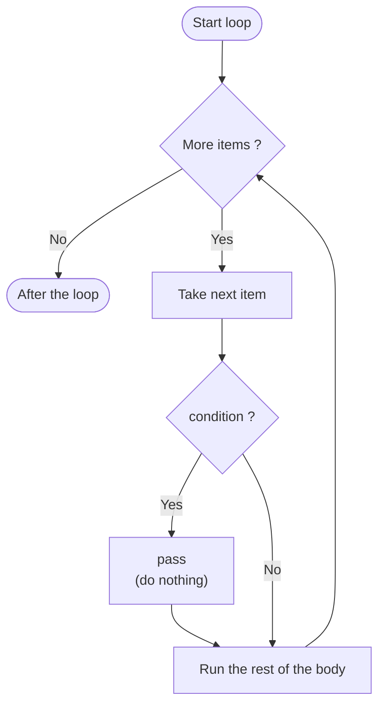

# Lesson 3: Controlling Loops — `break`, `continue`, `pass`, and loop `else`

*Part of the **Loops in Python** series · Lesson 3 of 5*

> **Before you start:** This lesson builds on **Lesson 1 (`for` loops)** and **Lesson 2 (`while` loops)**, and it uses `if` statements inside loops — so make sure conditionals are comfortable too. Type every example and run it.

---

## What You'll Learn

- How to stop a loop early with **`break`**
- How to skip a single pass with **`continue`**
- What **`pass`** does (and why it's different from `continue`)
- How the loop **`else`** clause works — and the one rule that makes it click
- That all of these work in **both `for` and `while`** loops

---

## 1. Loops That Stop, Skip, or Wait

Up to now, your loops have always run to the end — a `for` loop until `range()` is exhausted, a `while` loop until its condition turns false. But often you want **finer control**:

- Stop the moment you find what you're looking for → **`break`**
- Skip over one value but keep looping → **`continue`**
- Do nothing at all (a placeholder) → **`pass`**

These keywords work the same way no matter which kind of loop you use.

---

## 2. `break` — Stop the Loop Immediately

`break` ends the loop right away, even if there were more passes left.

```python
for n in range(1, 11):
    if n == 5:
        break
    print(n)
```

**Output:**
```
1
2
3
4
```

When `n` reaches 5, `break` fires and the loop stops — 5 is never printed, and neither are 6 through 10.

### `break` with a `while` loop

A very common pattern is `while True` (a loop that *looks* endless) with a `break` that gives it a way out:

```python
total = 0
n = 1
while True:
    total = total + n
    if total > 20:
        break
    n = n + 1
print(total)      # 21
```

The loop keeps adding until the total passes 20, then breaks. Without the `break`, `while True` really would run forever — so the two go hand in hand.

**Flowchart — `break`:** when the break condition is true, control jumps straight *out* of the loop, skipping any passes that were left.




---

## 3. `continue` — Skip to the Next Pass

`continue` skips the **rest of the current pass** and jumps straight to the next one. The loop keeps going.

```python
for n in range(1, 11):
    if n == 5:
        continue
    print(n)
```

**Output:**
```
1
2
3
4
6
7
8
9
10
```

Look at the difference: with `break` the loop *stopped* at 5; with `continue` it merely *skipped* 5 and carried on. Same structure, completely different behaviour.

> **`while` + `continue` warning:** in a `while` loop, make sure the line that updates your variable runs *before* any `continue`. If `continue` skips the update, the condition never changes and you get an infinite loop.

**Flowchart — `continue`:** when the continue condition is true, control jumps back to the *top* of the loop, skipping the rest of the body — but the loop keeps going.




---

## 4. `pass` — Do Nothing

`pass` is a statement that does **absolutely nothing**. It's a placeholder for spots where Python's grammar requires a statement but you have nothing to put there yet.

```python
for n in range(1, 6):
    if n == 3:
        pass
    print(n)
```

**Output:**
```
1
2
3
4
5
```

Notice that 3 **still prints**. Unlike `continue` (which would have skipped the `print`), `pass` simply does nothing and lets the rest of the body run as normal. It's most useful as a "I'll fill this in later" marker so your code still runs.

**Flowchart — `pass`:** notice that *both* branches lead to the rest of the body. `pass` changes nothing about the flow — it just occupies a spot where a statement is required.




---

## 5. The Loop `else` Clause

A loop can have an `else` block. Here's the rule that makes it make sense:

> **The loop `else` runs only if the loop finished *without* hitting a `break`.**

It's perfect for searching: break when you find something, and let `else` handle the "not found" case.

```python
# Searching for 3 - it IS there
for n in range(1, 6):
    if n == 3:
        print("Found 3!")
        break
else:
    print("3 was not in the range")
```
**Output:** `Found 3!` (the loop broke, so `else` is skipped.)

```python
# Searching for 9 - it is NOT there
for n in range(1, 6):
    if n == 9:
        print("Found 9!")
        break
else:
    print("9 was not in the range")
```
**Output:** `9 was not in the range` (the loop finished naturally, so `else` runs.)

A handy way to remember it: **"no break → else."** This works with `while` loops too — the `else` runs if the condition became false on its own, but not if a `break` ended things.

---

## 6. Side by Side: `break` vs `continue` vs `pass`

Now that each keyword has its own flowchart, here's how the three compare at a glance:

| Keyword | What it does | Rest of the body (this pass) | The loop |
|---------|--------------|------------------------------|----------|
| `break` | Leaves the loop right away | Skipped | **Stops** |
| `continue` | Jumps to the next pass | Skipped | Keeps going |
| `pass` | Does nothing | **Runs as normal** | Keeps going |

The key contrast: `break` and `continue` both skip the rest of the current pass, but `break` *ends* the loop while `continue` moves on to the *next* pass. `pass` is the odd one out — it changes nothing at all about the flow.

---

## 7. Common Mistakes to Avoid

### Mistake 1: Confusing `break` and `continue`

```python
# break STOPS the whole loop
for n in range(1, 6):
    if n == 3:
        break        # prints 1, 2

# continue SKIPS just this pass
for n in range(1, 6):
    if n == 3:
        continue     # prints 1, 2, 4, 5
    print(n)
```

### Mistake 2: An infinite loop from `continue`

```python
# WRONG - if n == 2, continue skips "n = n + 1", so n is stuck on 2 forever
n = 0
while n < 5:
    if n == 2:
        continue
    print(n)
    n = n + 1

# CORRECT - update the variable BEFORE the continue
n = 0
while n < 5:
    n = n + 1
    if n == 2:
        continue
    print(n)
```

### Mistake 3: `break` only exits one loop

In nested loops, `break` ends only the **innermost** loop it's in — the outer loop keeps going.

```python
for i in range(1, 4):
    for j in range(1, 4):
        if j == 2:
            break        # exits the inner loop only
        print(i, j)
# prints: 1 1, 2 1, 3 1
```

---

## 8. Quick Reference

```python
# break - stop the loop now
for i in range(10):
    if i == 5:
        break

# continue - skip the rest of this pass
for i in range(10):
    if i == 5:
        continue
    print(i)

# pass - do nothing (placeholder)
for i in range(10):
    if i == 5:
        pass

# loop else - runs only if NO break happened
for i in range(10):
    if i == target:
        break
else:
    print("not found")
```

---

## 9. Check Your Understanding (5 MCQs)

**Q1.** What does this print?
```python
for n in range(1, 8):
    if n == 4:
        break
    print(n)
```
- A) `1 2 3 4 5 6 7`
- B) `1 2 3 4`
- C) `1 2 3`
- D) `4 5 6 7`

**Q2.** What does this print?
```python
for n in range(1, 6):
    if n == 3:
        continue
    print(n)
```
- A) `1 2 4 5`
- B) `1 2 3 4 5`
- C) `1 2`
- D) `3`

**Q3.** What does this print?
```python
for n in range(1, 4):
    if n == 2:
        pass
    print(n)
```
- A) `1 3`
- B) `1 2 3`
- C) `1 2`
- D) `2`

**Q4.** What does this print?
```python
for n in range(1, 4):
    print(n)
else:
    print("Done")
```
- A) `1 2 3` then `Done`
- B) `1 2 3`
- C) `Done`
- D) Just `1 2 3`, with no `Done`

**Q5.** What does this print?
```python
for n in range(1, 6):
    if n == 2:
        break
else:
    print("Finished")
print("End")
```
- A) `Finished` then `End`
- B) `Finished`
- C) `End`
- D) Nothing

<details>
<summary><strong>Answer Key (tap to reveal)</strong></summary>

**Q1 — C (`1 2 3`).** `break` stops the loop when `n` is 4, so 4 itself is never printed.

**Q2 — A (`1 2 4 5`).** `continue` skips only the pass where `n` is 3; the loop keeps going.

**Q3 — B (`1 2 3`).** `pass` does nothing, so 2 still prints — that's the key difference from `continue`.

**Q4 — A (`1 2 3` then `Done`).** No `break` happened, so the loop's `else` runs after the loop finishes.

**Q5 — C (`End`).** The `break` fires, so the loop's `else` is skipped; only the final `print("End")` runs.

</details>

---

## 10. Coding Challenges (5 Problems)

Write and **run** each one. Solutions follow — try first!

**Problem 1 — Stop at Eight.**
Print the numbers from 1 to 20, but use `break` to stop completely as soon as you reach 8.

**Problem 2 — Skip Six.**
Print the numbers from 1 to 10, but use `continue` to skip the number 6.

**Problem 3 — Add Until Fifty.**
Starting from a total of 0, use a `while True` loop to keep adding 5 and printing the running total. Use `break` to stop once the total reaches 50.

**Problem 4 — In Range or Not.**
Ask the user for a whole number. Search the numbers 1 to 10: if the user's number is found, print `In range` and `break`; if the loop finishes without finding it, use the loop `else` to print `Out of range`.

**Problem 5 — Skip and Stop.**
Print the numbers from 1 to 15, but skip the number 5 (with `continue`) and stop entirely when you reach 12 (with `break`).

<details>
<summary><strong>Solutions (tap to reveal)</strong></summary>

**Solution 1**
```python
for n in range(1, 21):
    if n == 8:
        break
    print(n)
```

**Solution 2**
```python
for n in range(1, 11):
    if n == 6:
        continue
    print(n)
```

**Solution 3**
```python
total = 0
while True:
    total = total + 5
    print(total)
    if total >= 50:
        break
```

**Solution 4**
```python
target = int(input("Enter a number: "))
for n in range(1, 11):
    if n == target:
        print("In range")
        break
else:
    print("Out of range")
```

**Solution 5**
```python
for n in range(1, 16):
    if n == 5:
        continue
    if n == 12:
        break
    print(n)
```

</details>

---

## Summary

- **`break`** ends a loop immediately; **`continue`** skips the rest of the current pass and moves on.
- **`pass`** does nothing — it's a placeholder, and (unlike `continue`) it lets the rest of the body run.
- The loop **`else`** clause runs only when the loop finishes **without** a `break` — ideal for "not found" messages.
- All four work in **both `for` and `while`** loops.
- In nested loops, `break` exits only the **innermost** loop, and in `while` loops, be careful that `continue` doesn't skip your update line.

Next up — **Lesson 5: Common Loop Patterns**, where we combine everything into the accumulator, counting, finding the largest or smallest value, and the flag pattern.
