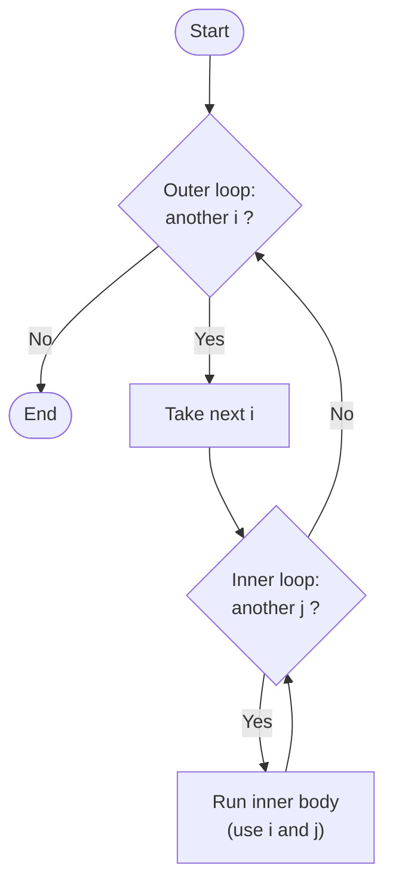

# Lesson 4: Nested Loops

*Part of the **Loops in Python** series · Lesson 4 of 5*

> **Before you start:** This lesson builds directly on **Lesson 1 (`for` loops)** and **Lesson 1a (`range()`)**. You should be comfortable writing a single `for` loop and tracing it by hand. Type every example and run it.

---

## What You'll Learn

- What a **nested loop** is and when you need one
- How the **inner loop runs completely for every pass of the outer loop**
- How to count the total number of times the inner body runs
- How to build **grids, tables, and number patterns**
- How to make the inner loop **depend on the outer** loop variable

---

## 1. A Loop Inside a Loop

Sometimes repeating an action once isn't enough — you need to repeat something that *itself* repeats. Think of a table with rows and columns: for **each row**, you fill in **every column**. That's a loop inside a loop, called a **nested loop**.

```python
for i in range(1, 3):        # outer loop
    for j in range(1, 4):    # inner loop
        print(i, j)
```

**Output:**
```
1 1
1 2
1 3
2 1
2 2
2 3
```

The outer loop ran twice (`i` = 1, then 2). But for **each** of those, the inner loop ran all the way through (`j` = 1, 2, 3). That's the heart of nested loops.

---

## 2. The Shape of a Nested Loop

```python
for i in range(...):         # OUTER loop
    for j in range(...):     # INNER loop (indented inside the outer)
        do_something(i, j)   # body (indented twice)
```

Two things to notice:

1. The inner loop is **indented inside** the outer loop's body.
2. The innermost line is indented **twice** (8 spaces) — once for each loop it lives inside.

**The golden rule:** for every single pass of the outer loop, the inner loop starts over and runs to completion. If the outer loop runs 2 times and the inner loop runs 3 times, the inner body runs **2 × 3 = 6** times.

---

## 3. Walkthrough: Tracing a Nested Loop

Let's trace the example from above carefully. Watch how `j` resets to 1 every time `i` moves on.

```python
for i in range(1, 3):
    for j in range(1, 4):
        print(i, j)
```

| Outer `i` | Inner `j` | Prints |
|-----------|-----------|--------|
| 1         | 1         | `1 1`  |
| 1         | 2         | `1 2`  |
| 1         | 3         | `1 3`  |
| 2         | 1         | `2 1`  |
| 2         | 2         | `2 2`  |
| 2         | 3         | `2 3`  |

Read it top to bottom: `i` stays at 1 while `j` runs 1→2→3, then `i` becomes 2 and `j` **starts over** at 1. Six rows in the table, six lines of output.

---

## 4. Flowchart: How a Nested Loop Works

The inner loop is a complete cycle *inside* the outer cycle. Only when the inner loop runs out of numbers does control go back to the outer loop for its next value.




---

## 5. Making a Grid (with `print()` for rows)

A very common use of nested loops is printing a grid — like a multiplication table. The trick is an **empty `print()`** *after* the inner loop, which ends the current row and starts a new line.

```python
for i in range(1, 4):
    for j in range(1, 4):
        print(i * j, end=" ")
    print()          # ends the row
```

**Output:**
```
1 2 3
2 4 6
3 6 9
```

Here's what's happening:

- `print(i * j, end=" ")` prints each value on the **same line** (because `end=" "` replaces the usual newline with a space).
- The bare `print()` runs once per outer pass — *after* the inner loop finishes — to drop down to the next row.

Notice the `print()` is indented to line up with the **inner loop**, not the inner body — it belongs to the outer loop, so it runs once per row.

---

## 6. When the Inner Loop Depends on the Outer

The inner `range()` doesn't have to be fixed — it can use the outer variable. This is how you make triangles and other growing patterns:

```python
for i in range(1, 5):
    for j in range(1, i + 1):    # inner range depends on i
        print(j, end=" ")
    print()
```

**Output:**
```
1
1 2
1 2 3
1 2 3 4
```

On row `i`, the inner loop runs from 1 to `i`, so each row gets one more number than the last. Row 1 prints one number, row 4 prints four. This dependency between the loops is what makes nested loops so powerful.

---

## 7. Common Mistakes to Avoid

### Mistake 1: Wrong indentation level

```python
# WRONG - print() is indented under the INNER loop,
# so it runs every inner pass and you get one number per line
for i in range(1, 4):
    for j in range(1, 4):
        print(i * j, end=" ")
        print()      # too far indented!

# CORRECT - print() lines up with the inner loop (runs once per row)
for i in range(1, 4):
    for j in range(1, 4):
        print(i * j, end=" ")
    print()
```

### Mistake 2: Reusing the same loop variable

```python
# WRONG - both loops use i, so they fight over the same variable
for i in range(1, 4):
    for i in range(1, 4):    # confusing and buggy
        print(i)

# CORRECT - give each loop its own variable
for i in range(1, 4):
    for j in range(1, 4):
        print(i, j)
```

### Mistake 3: Forgetting the inner loop restarts every time

The inner loop is **not** continued from where it left off — it begins again from the start on every outer pass. Expecting it to "carry on" is a common source of confusion.

---

## 8. Quick Reference

```python
# Basic nested loop
for i in range(rows):
    for j in range(cols):
        ...                 # runs rows × cols times

# Grid / table (one row per outer pass)
for i in range(1, 4):
    for j in range(1, 4):
        print(i * j, end=" ")
    print()                 # ends the row

# Inner depends on outer (triangle)
for i in range(1, n + 1):
    for j in range(1, i + 1):
        print(j, end=" ")
    print()
```

---

## 9. Check Your Understanding (5 MCQs)

**Q1.** How many times does the inner body run in total?
```python
for i in range(3):
    for j in range(2):
        print("hi")
```
- A) 3
- B) 5
- C) 6
- D) 2

**Q2.** What does this print?
```python
for i in range(1, 3):
    for j in range(1, 3):
        print(i, j)
```
- A) `1 1`, `2 2`
- B) `1 1`, `1 2`, `2 1`, `2 2`
- C) `1 2`, `3 4`
- D) `1 1`, `1 2`, `1 3`, `2 1`

**Q3.** What is the **last** thing this prints?
```python
for i in range(1, 4):
    for j in range(1, 3):
        print(i * j)
```
- A) `9`
- B) `3`
- C) `6`
- D) `4`

**Q4.** For each single pass of the outer loop, how many times does the inner loop run?
```python
for i in range(5):
    for j in range(4):
        ...
```
- A) Once
- B) 4 times, fully, on every outer pass
- C) 5 times
- D) 20 times

**Q5.** What does this print?
```python
for i in range(1, 3):
    for j in range(1, 4):
        print(j, end=" ")
    print()
```
- A)
  ```
  1 2 3
  1 2 3
  ```
- B)
  ```
  1 2 3
  ```
- C) `1 2 3 1 2 3` on one line
- D) An error

<details>
<summary><strong>Answer Key (tap to reveal)</strong></summary>

**Q1 — C (6).** The outer loop runs 3 times and the inner runs 2 times each, so the inner body runs 3 × 2 = 6 times.

**Q2 — B.** `i` stays at 1 while `j` goes 1, 2, then `i` becomes 2 and `j` restarts: `1 1`, `1 2`, `2 1`, `2 2`.

**Q3 — C (`6`).** The very last pass is `i` = 3, `j` = 2, so it prints 3 × 2 = 6.

**Q4 — B.** The inner loop runs completely (4 times) for *every* pass of the outer loop — it starts over each time.

**Q5 — A.** The inner loop prints `1 2 3` on one line; the `print()` after it ends the row; then the outer loop repeats, giving a second `1 2 3`.

</details>

---

## 10. Coding Challenges (5 Problems)

Write and **run** each one. Solutions follow — try first!

**Problem 1 — All Pairs.**
Using nested loops, print every pair `(i, j)` for `i` from 1 to 3 and `j` from 1 to 3 — print each pair as `i j` on its own line (you should get 9 lines).

**Problem 2 — Multiplication Grid.**
Print a 3×3 grid where each cell is `i × j`, so the output reads:
```
1 2 3
2 4 6
3 6 9
```

**Problem 3 — Number Triangle.**
Print this triangle, where row `i` contains the numbers 1 up to `i`:
```
1
1 2
1 2 3
1 2 3 4
```

**Problem 4 — Grid Total.**
Using nested loops, add up `i × j` for every `i` from 1 to 3 and `j` from 1 to 3, and print the single total at the end. (The answer is 36.)

**Problem 5 — Times Tables.**
For each of the numbers 2, 3, and 4, print its full multiplication table from 1 to 10 (each line like `2 x 1 = 2`).

<details>
<summary><strong>Solutions (tap to reveal)</strong></summary>

**Solution 1**
```python
for i in range(1, 4):
    for j in range(1, 4):
        print(i, j)
```

**Solution 2**
```python
for i in range(1, 4):
    for j in range(1, 4):
        print(i * j, end=" ")
    print()
```

**Solution 3**
```python
for i in range(1, 5):
    for j in range(1, i + 1):
        print(j, end=" ")
    print()
```

**Solution 4**
```python
total = 0
for i in range(1, 4):
    for j in range(1, 4):
        total = total + i * j
print(total)   # 36
```

**Solution 5**
```python
for n in range(2, 5):
    for j in range(1, 11):
        print(n, "x", j, "=", n * j)
```

</details>

---

## Summary

- A **nested loop** is a loop inside another loop — useful for grids, tables, and patterns.
- The **inner loop runs completely for every pass of the outer loop**, so the inner body runs (outer count × inner count) times.
- An empty **`print()`** after the inner loop, lined up with it, ends each row of a grid.
- The inner `range()` can **depend on the outer variable** to build growing patterns like triangles.
- Each loop should have its **own variable**, and indentation decides which loop a line belongs to.

Next up — **Lesson 5: Common Loop Patterns**, where we pull together the accumulator, counting, finding the largest or smallest value, and the flag pattern.
