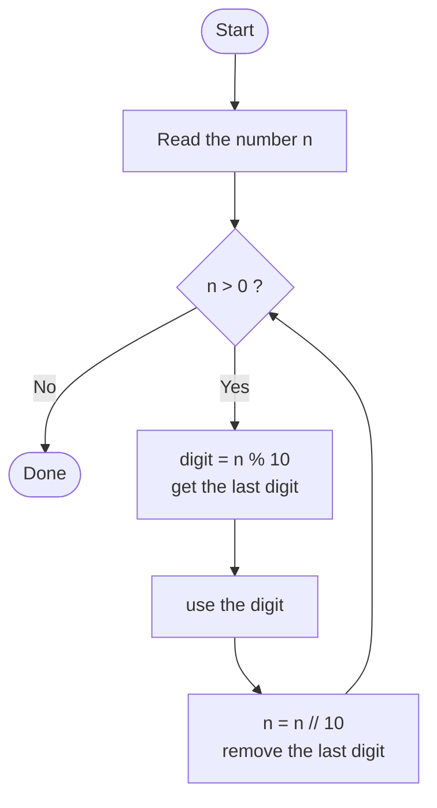

# Lesson 6: Classic Number Problems

*Part of the **Loops in Python** series · Lesson 6*

> **Before you start:** This lesson uses **`for` and `while` loops** (Lessons 1–3) and `if` statements freely, and assumes you already know the `%` (remainder) and `//` (integer division) operators. Here we put them to work on the classic problems.

---

## What You'll Learn

- **Pattern 1** — using `%` and `//` to break a number into its digits, to solve sum of digits, reverse, palindrome, and Armstrong
- **Pattern 2** — testing divisors, to solve prime and perfect numbers
- How to combine loops to check a **happy number**

These are the "classic" problems every programmer meets early on — and they're all built from just two reusable patterns.

---

## 1. Pattern 1 — Breaking a Number into Digits

The most useful trick in this lesson leans on `%` and `//`, which you already know. Two operations let you peel digits off a number one at a time:

- `n % 10` gives the **last digit**.
- `n // 10` **removes** the last digit.

Put them in a loop and you can visit every digit, right to left:

```python
n = 1234
while n > 0:
    digit = n % 10      # last digit
    print(digit)        # do something with it
    n = n // 10         # chop off the last digit
```

**Output:**
```
4
3
2
1
```

Trace it: `1234 % 10` is 4, then `1234 // 10` is 123; next `123 % 10` is 3, and `123 // 10` is 12; and so on until `n` becomes 0.




Once you have this loop, the only thing that changes between problems is **what you do with each digit**.

### Sum of Digits

Add each digit to a running total:

```python
n = 1234
total = 0
while n > 0:
    total = total + n % 10
    n = n // 10
print(total)        # 10  (1 + 2 + 3 + 4)
```

### Count of Digits

Count once per pass instead of adding:

```python
n = 1234
count = 0
while n > 0:
    count = count + 1
    n = n // 10
print(count)        # 4
```

---

## 2. Reversing a Number (and Palindromes)

To reverse a number, build a new number digit by digit. The trick is `rev = rev * 10 + digit`: each new digit pushes the others left.

```python
n = 1234
rev = 0
while n > 0:
    digit = n % 10
    rev = rev * 10 + digit
    n = n // 10
print(rev)          # 4321
```

Watch `rev` grow: start 0, then `0*10 + 4 = 4`, then `4*10 + 3 = 43`, then `43*10 + 2 = 432`, then `432*10 + 1 = 4321`.

A **palindrome** is a number that reads the same backwards (like 121 or 1331). To check one, reverse it and compare to the original — but remember to save the original first, because the loop destroys `n`:

```python
n = 121
original = n          # save it before the loop changes n
rev = 0
while n > 0:
    rev = rev * 10 + n % 10
    n = n // 10
if rev == original:
    print("Palindrome")
else:
    print("Not a palindrome")
```

---

## 3. Armstrong Numbers

A 3-digit **Armstrong number** equals the sum of the **cubes** of its digits. For example, 153 = 1³ + 5³ + 3³ = 1 + 125 + 27 = 153.

It's just the digit loop, cubing each digit as you go:

```python
n = 153
original = n
total = 0
while n > 0:
    digit = n % 10
    total = total + digit * digit * digit
    n = n // 10
if total == original:
    print("Armstrong")
else:
    print("Not Armstrong")
```

(The other 3-digit Armstrong numbers are 370, 371, and 407 — try them.)

---

## 4. Pattern 2 — Testing Divisors

The second pattern checks which numbers divide `n` evenly, using `n % i == 0`. Loop `i` over a range and test each one:

```python
n = 12
for i in range(1, n + 1):
    if n % i == 0:
        print(i, "is a divisor")
# prints 1, 2, 3, 4, 6, 12
```

### Prime Numbers

A **prime number** has exactly two divisors: 1 and itself. So count the divisors — if there are exactly 2, it's prime:

```python
n = 7
count = 0
for i in range(1, n + 1):
    if n % i == 0:
        count = count + 1
if count == 2:
    print("Prime")
else:
    print("Not prime")
```

This neatly handles 1 as well (it has only one divisor, so it isn't prime).

### Perfect Numbers

A **perfect number** equals the sum of its *proper* divisors — its divisors not counting itself. The smallest is 6 = 1 + 2 + 3. Loop only up to `n - 1` so you exclude the number itself:

```python
n = 6
total = 0
for i in range(1, n):
    if n % i == 0:
        total = total + i
if total == n:
    print("Perfect")
else:
    print("Not perfect")
```

(28 is the next perfect number: 1 + 2 + 4 + 7 + 14 = 28.)

---

## 5. Going Further — Happy Numbers

A **happy number** is found by replacing the number with the sum of the *squares* of its digits, and repeating. If you eventually reach 1, it's happy; if not, you fall into a cycle that always passes through 4. So loop until the number is 1 or 4:

```python
n = 19
while n != 1 and n != 4:
    total = 0
    while n > 0:               # inner loop: sum of squared digits
        digit = n % 10
        total = total + digit * digit
        n = n // 10
    n = total
if n == 1:
    print("Happy")
else:
    print("Not happy")
```

For 19: 1² + 9² = 82 → 8² + 2² = 68 → 6² + 8² = 100 → 1² + 0² + 0² = 1 → **happy!** Notice this is a loop *inside* a loop — the inner one breaks the number into digits, the outer one keeps repeating until the answer settles.

---

## 6. Common Mistakes to Avoid

### Mistake 1: Using the wrong one to get a digit

In a digit loop, `n % 10` gives the **last digit** while `n // 10` **removes** it — swapping the two is a common slip.

```python
print(23 % 10)   # 3  -> the last digit
print(23 // 10)  # 2  -> the number with its last digit removed
```

### Mistake 2: Forgetting to save the original

```python
# WRONG - the loop changes n, so there's nothing left to compare against
n = 121
rev = 0
while n > 0:
    rev = rev * 10 + n % 10
    n = n // 10
if rev == n:        # n is now 0!
    print("Palindrome")

# CORRECT - save the original first (see Section 3)
```

### Mistake 3: Forgetting to remove the last digit

If you write `n % 10` but forget `n = n // 10`, the last digit never changes and `n > 0` stays true forever — an infinite loop. Every digit loop needs the `n = n // 10` step.

---

## 7. Quick Reference

```python
# Visit every digit (right to left)
while n > 0:
    digit = n % 10
    # ... use digit ...
    n = n // 10

# Sum of digits        -> total = total + n % 10
# Count of digits      -> count = count + 1
# Reverse a number     -> rev = rev * 10 + n % 10
# Largest digit        -> if (n % 10) > big: big = n % 10

# Find divisors of n
for i in range(1, n + 1):
    if n % i == 0:
        # i divides n

# Prime    -> exactly 2 divisors
# Perfect  -> sum of divisors below n equals n
```

---

## 8. Check Your Understanding (5 MCQs)

**Q1.** In a digit loop, what does `n % 10` give you?
- A) The first digit
- B) The last digit
- C) The number of digits
- D) `n` divided by 10

**Q2.** In a digit loop, what does `n // 10` do to `n`?
- A) Doubles it
- B) Gives its last digit
- C) Removes its last digit
- D) Reverses it

**Q3.** Which of these is a **perfect** number?
- A) `6`
- B) `8`
- C) `9`
- D) `10`

**Q4.** Which condition is true exactly when `n` is **even**?
- A) `n % 2 == 1`
- B) `n // 2 == 0`
- C) `n % 2 == 0`
- D) `n % 10 == 0`

**Q5.** What does this print?
```python
n = 35
while n > 0:
    print(n % 10)
    n = n // 10
```
- A) `3` then `5`
- B) `5` then `3`
- C) `35`
- D) `5`

<details>
<summary><strong>Answer Key (tap to reveal)</strong></summary>

**Q1 — B (the last digit).** `n % 10` is the remainder after dividing by 10, which is always the last digit.

**Q2 — C (removes its last digit).** `n // 10` drops the last digit — the key step that lets a digit loop end.

**Q3 — A (`6`).** A perfect number equals the sum of its divisors below itself: 6 = 1 + 2 + 3.

**Q4 — C.** A number is even when dividing by 2 leaves no remainder, i.e. `n % 2 == 0`.

**Q5 — B (`5` then `3`).** The loop peels digits off the end: `35 % 10` is 5, then `35 // 10` is 3, which prints 3 before stopping.

</details>

---

## 9. Coding Challenges (5 Problems)

Write and **run** each one. Solutions follow — try first!

**Problem 1 — Count the Digits.**
Ask the user for a whole number and print how many digits it has.

**Problem 2 — Largest Digit.**
Ask the user for a whole number and print its largest digit.

**Problem 3 — Product of Digits.**
Ask the user for a whole number and print the product of all its digits (multiply them together).

**Problem 4 — Sum of Even Digits.**
Ask the user for a whole number and print the sum of only its **even** digits.

**Problem 5 — All Divisors.**
Ask the user for a whole number and print all of its divisors (every number that divides it evenly), each on its own line.

<details>
<summary><strong>Solutions (tap to reveal)</strong></summary>

**Solution 1**
```python
n = int(input("Enter a number: "))
count = 0
while n > 0:
    count = count + 1
    n = n // 10
print(count)
```

**Solution 2**
```python
n = int(input("Enter a number: "))
biggest = 0
while n > 0:
    digit = n % 10
    if digit > biggest:
        biggest = digit
    n = n // 10
print(biggest)
```

**Solution 3**
```python
n = int(input("Enter a number: "))
product = 1
while n > 0:
    product = product * (n % 10)
    n = n // 10
print(product)
```

**Solution 4**
```python
n = int(input("Enter a number: "))
total = 0
while n > 0:
    digit = n % 10
    if digit % 2 == 0:
        total = total + digit
    n = n // 10
print(total)
```

**Solution 5**
```python
n = int(input("Enter a number: "))
for i in range(1, n + 1):
    if n % i == 0:
        print(i)
```

</details>

---

## Summary

- **`%`** gives the remainder and **`//`** gives the quotient — together they let you take a number apart.
- **Pattern 1 (digits):** `n % 10` reads the last digit and `n // 10` removes it; loop while `n > 0` to solve sum of digits, reverse, palindrome, and Armstrong.
- **Pattern 2 (divisors):** test `n % i == 0` over a range to find divisors, then count or sum them for prime and perfect numbers.
- Always **save the original** before a digit loop changes it, and never forget the `n = n // 10` step.
- Harder problems like the **happy number** just combine these patterns — a digit loop inside a repeating loop.

Next up — **Lesson 5: Common Loop Patterns**, which names the building blocks (accumulator, counting, largest/smallest, and the flag pattern) you've now been using all along.
