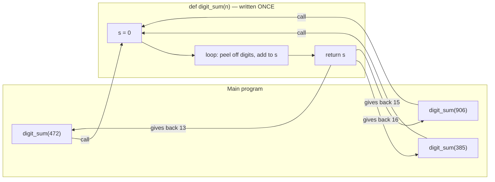

# Lesson 01 — Introduction to Functions

**Unit 3 · Functions and Recursion**

## What You'll Learn

- What a function is, and why programmers invented them
- The problem that appears when the same code is written again and again
- The four big advantages of functions: **reusability**, **modularity**, **easy debugging**, and **better readability**
- How to read a program that uses a function (writing your own starts in Lesson 03)

---

## 1. A Problem You Already Have

Here is a program you could write today with what you know. It finds the digit sum of three different numbers:

```python
n = 472
s = 0
while n > 0:
    s = s + n % 10
    n = n // 10
print(s)

n = 385
s = 0
while n > 0:
    s = s + n % 10
    n = n // 10
print(s)

n = 906
s = 0
while n > 0:
    s = s + n % 10
    n = n // 10
print(s)
```

Output:
```
13
16
15
```

It works. But look at it honestly:

- The **same five lines** appear three times.
- The program is **15 lines** long for what is really one idea.
- If you need a fourth number, you copy the block **again**.
- If the loop has a mistake, the mistake exists in **three places**.

Copying code like this is where bugs are born. Programmers hit this problem so often that every programming language has a cure for it — and the cure is the **function**.

---

## 2. What Is a Function?

> A **function** is a named block of code, written once, that you can run whenever you want by using its name.

Here's the surprise: **you have been using functions since your very first program.**

```python
print("Hello")        # print is a function
age = int(input())    # input and int are BOTH functions
```

Somebody at Python wrote the code that puts text on the screen — once. You run that code every time you write `print(...)`. You never see its inside, and you never need to. You just **call** it by name.

Two words you'll use constantly from now on:

| Word | Meaning |
|---|---|
| **define** a function | write the block of code and give it a name |
| **call** a function | make that block run by using its name |

The functions you've used so far — `print()`, `input()`, `int()` — were defined by Python's creators. They are called **built-in functions** (Lesson 02 tours them). A function *you* define is a **user-defined function** (Lesson 03 teaches you how).

---

## 3. The Same Program, With a Function

Here is the digit-sum program rewritten. The loop is now written **once**, inside a function named `digit_sum`:

```python
def digit_sum(n):
    s = 0
    while n > 0:
        s = s + n % 10
        n = n // 10
    return s

print(digit_sum(472))
print(digit_sum(385))
print(digit_sum(906))
```

Output:
```
13
16
15
```

Exactly the same output — from **9 lines instead of 15**.

Don't worry about the new words `def` and `return` yet; Lesson 03 teaches the syntax carefully. Today, just read the shape of it:

- The block under `def digit_sum(n):` is the recipe, written once.
- Each line like `digit_sum(472)` **calls** the recipe with a different number.
- The recipe hands its answer back, and `print` shows it.

Here is the whole story as a picture — three calls flowing into one function, three answers flowing back:


<details>
<summary>Mermaid source for this diagram</summary>


</details>

Now let's name the four advantages precisely — these are exam favourites, and each one deserves its own demonstration.

---

## 4. Advantage 1 — Code Reusability

**Write once, use many times.**

In the function version, the digit-sum logic exists in exactly one place. Using it on a new number costs **one line**, not five:

```python
print(digit_sum(2468))
```

The saving grows fast. Digit sum of ten numbers? Copy-paste version: 50 lines. Function version: the 6-line function plus 10 one-line calls. And a function you wrote for this program can be reused in your **next** program, too — real programmers build up a toolbox of functions they trust.

---

## 5. Advantage 2 — Modularity

**A big program becomes small named pieces.**

*Modular* means built from separate parts — like bricks. Compare two versions of a ticket-bill program (₹150 per ticket, 10% off on bills of ₹600 or more):

**Version A — one lump:**

```python
tickets = 5
cost = tickets * 150
if cost >= 600:
    cost = cost - cost // 10
print(cost)
```

**Version B — built from parts:**

```python
def ticket_cost(tickets):
    return tickets * 150

def apply_discount(cost):
    if cost >= 600:
        return cost - cost // 10
    return cost

tickets = 5
cost = ticket_cost(tickets)
total = apply_discount(cost)
print(total)
```

Both print:
```
675
```

For five lines, Version A is fine. But real billing programs are hundreds of lines — and in Version B, the main part of the program **reads like a plan**:

> get the ticket cost → apply the discount → print the total

Each piece has one job, its own name, and its own private workspace. You can think about `apply_discount` **without** thinking about anything else. That's modularity: dividing one big problem into small, named, independent parts.

---

## 6. Advantage 3 — Easy Debugging

**Fix a bug in one place, and it's fixed everywhere.**

This is the advantage that saves careers. Watch what happens in the copy-paste world.

Suppose the digit-sum loop had been written with a bug: `s = s + n // 10` instead of `s = s + n % 10`. You find the bug, and you fix it... in the first copy, and the second copy — but you **miss the third**:

```python
n = 906
s = 0
while n > 0:
    s = s + n // 10      # ← the forgotten copy, still buggy
    n = n // 10
print(s)
```

The program now prints:

```
13
16
99
```

Two right answers and one silent disaster — `99` instead of `15`. Nothing crashes. No error message appears. The wrong number just flows into the rest of your program. Bugs like this, where a fix is applied to some copies but not all, are among the **most common real-world bugs** — and among the hardest to find, because you *remember fixing it*.

In the function version this bug **cannot happen**. The loop exists in one place. You fix that one place, and every single call — `digit_sum(472)`, `digit_sum(906)`, and any call you write next year — is fixed at the same instant.

---

## 7. Advantage 4 — Better Readability

**Good names make code read like English.**

You know from the loops unit how to check whether a number is prime: count its divisors and see if the count is 2. Buried inline, that logic takes concentration to recognize. Wrapped in a well-named function, it disappears into a single readable line:

```python
def is_prime(n):
    c = 0
    for i in range(1, n + 1):
        if n % i == 0:
            c = c + 1
    return c == 2

for k in range(2, 21):
    if is_prime(k):
        print(k, end=" ")
```

Output:
```
2 3 5 7 11 13 17 19
```

Read the important line out loud: *"if k is prime, print k."* The function's **name** carries the meaning. Someone can understand what your program does without reading how every part works — the same way you use `print()` daily without ever reading its inside.

A quick taste of what's coming: names like `is_prime` follow rules and conventions (lowercase, words joined by underscores, verbs for actions). Lesson 03 covers naming properly.

---

## Common Misconceptions

**1. "A function runs as soon as it is written."**
No — *defining* a function only teaches Python the recipe. Nothing runs until the function is **called**. (Lesson 03 makes a big deal of this, because it explains many confusing programs.)

**2. "Functions are only for shortening code."**
Shorter is one benefit, but the deeper wins are the four advantages above. Even a function called only **once** can be worth writing, purely for modularity and readability.

**3. "A function must take input from the user."**
No. Values enter a function through its parentheses — `digit_sum(472)` — not through `input()`. A function is a worker you hand values to; `input()` is just one possible source of those values.

**4. "print inside the function is the same as giving the answer back."**
They are different, and the difference matters enormously. `digit_sum` *hands its result back* so the program can use it further. This is the `return` vs `print` distinction — the single most important idea in Lesson 05. For now, just notice that `return` exists.

---

## Quick Reference

| Term | Meaning |
|---|---|
| **Function** | A named block of code, written once, run on demand |
| **Define** | Write the function's code and give it a name (`def`) |
| **Call** | Run the function by using its name: `digit_sum(472)` |
| **Built-in function** | Comes with Python: `print()`, `input()`, `int()` |
| **User-defined function** | Written by you, with `def` |
| **Reusability** | Write once, call many times |
| **Modularity** | Program built from small named parts |
| **Easy debugging** | One fix repairs every call |
| **Readability** | Good names make code self-explaining |

---

## Check Your Understanding

**Q1.** What is the **main** problem with copying the same block of code into a program three times?

- A) The program runs three times slower
- B) A change or fix must be made in three places, and it's easy to miss one
- C) Python does not allow the same code to appear twice
- D) The output will be printed three times

<details>
<summary>Answer</summary>

**B.** Duplicated code multiplies the cost of every change. The program runs fine — until a fix lands in some copies but not all.
</details>

**Q2.** A teammate says: *"I found the bug, changed one line inside the function, and every part of the program that uses it now works."* Which advantage of functions is this?

- A) Code reusability
- B) Better readability
- C) Easy debugging
- D) Modularity

<details>
<summary>Answer</summary>

**C.** One fix, fixed everywhere — that is exactly the easy-debugging advantage. (Reusability is about *using* the code many times; this story is about *repairing* it once.)
</details>

**Q3.** How many times does the **body** of this function run?

```python
def show_double(n):
    print(2 * n)

show_double(4)
show_double(7)
show_double(10)
```

- A) 3 times — once per call
- B) 1 time — a function's body runs only once
- C) 4 times — once when defined, then once per call
- D) 0 times — nothing is returned

<details>
<summary>Answer</summary>

**A.** The body runs once for every **call**: it prints 8, then 14, then 20. Defining the function runs nothing at all — that's why C is wrong.
</details>

**Q4.** Which of these is a **built-in** function you have already been using?

- A) `digit_sum()`
- B) `is_prime()`
- C) `apply_discount()`
- D) `print()`

<details>
<summary>Answer</summary>

**D.** `print()` comes with Python — someone else defined it, you just call it. The other three are user-defined functions from this lesson.
</details>

**Q5.** A program contains the line `if is_leap_year(y):` — and a reader who has never seen the rest of the code instantly understands what the line checks. Which advantage is at work?

- A) Easy debugging
- B) Better readability
- C) Code reusability
- D) Faster execution

<details>
<summary>Answer</summary>

**B.** The function's *name* tells the story, so the code reads like a sentence. That is readability. (D is not one of the four advantages at all — functions organize code; they don't speed it up.)
</details>

---

## Summary

- Repeating code is expensive: longer programs, more typing, and bugs that must be fixed in many places.
- A **function** is a named block of code — **defined** once, **called** whenever needed.
- You already call **built-in** functions daily (`print`, `input`, `int`); soon you'll define your own.
- The four advantages, each with its own flavour:
  - **Reusability** — write once, call many times
  - **Modularity** — big problems become small named parts
  - **Easy debugging** — one fix repairs every call (remember the silent `99`!)
  - **Readability** — `if is_prime(k):` reads like English

**Next up — Lesson 02: Built-in Functions.** A guided tour of the tools Python already gives you: old friends `print`, `input`, `int`, `float` get formalized, and you meet `len`, `type`, `str`, `max`, `min`, `sum`, and `round`.
