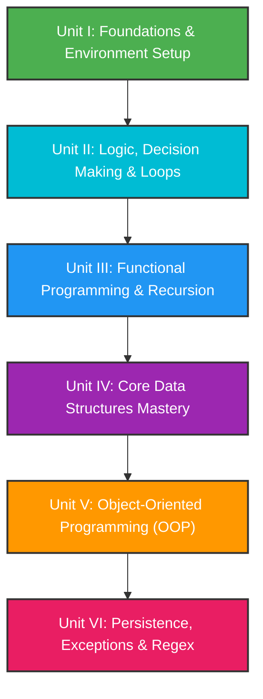
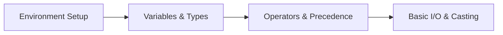
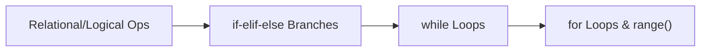
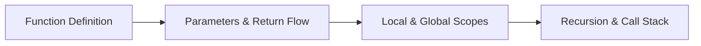
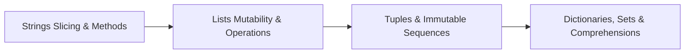
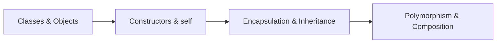
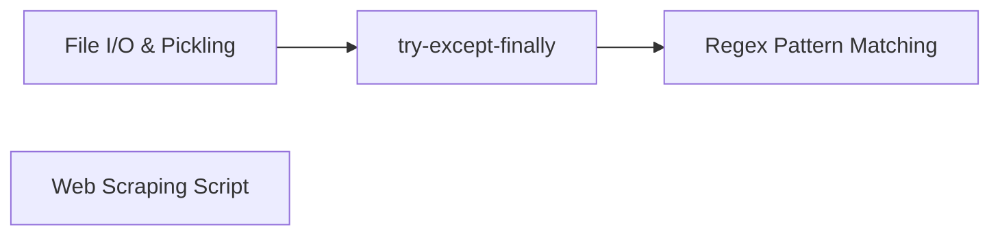

# 🏆 INT108 Python Programming: Zero-to-Mastery Course Roadmap
*Designed by a Human Teacher for First-Year Computer Science Students*

---

## 🏫 Course Philosophy & Design
Teaching first-year students with **zero programming experience** requires bridging the gap between abstract syntax and concrete mental models. This roadmap does not simply list topics; it structures them to build intuition. It maps the university's generic syllabus directly to a logical progression of software engineering concepts, moving from basic environment setups to advanced Object-Oriented Design and automated script writing.

### Key Scaffolding Pillars:
1. **Mental Analogies First**: Abstract ideas (e.g., variables, loops, objects) are introduced using physical, real-world metaphors (mailboxes, running tracks, blueprint factories).
2. **The Landmines (Common Pitfalls)**: Every chapter highlights the exact syntax and logical traps that beginners fall into, fostering active debugging habits.
3. **University Syllabus Alignment**: 100% of the generic INT108 syllabus concepts and course outcomes are integrated into these 6 units.
4. **Mastery-Level Extensions**: Industry practices—such as virtual environments, clean code (PEP 8), list comprehensions, magic methods, custom exceptions, and ethical web scraping—are layered on top of core topics.

---

## 🗺️ University Course Outcomes (CO) Mapping

| Course Outcome | Description | Covered In |
| :--- | :--- | :--- |
| **CO1** | Describe the installation of Python environment and basics of Python language. | **Unit I** |
| **CO2** | Apply conditional and iterative statements for evaluating appropriate alternates. | **Unit II** |
| **CO3** | Explore functions, including recursion, with parameters and arguments in Python. | **Unit III** |
| **CO4** | Construct core data structures like lists, dictionaries, tuples, and sets to store, process, and sort data. | **Unit IV** |
| **CO5** | Apply the concepts of Object-Oriented Programming (encapsulation, polymorphism, inheritance, composition). | **Unit V** |
| **CO6** | Examine file handling operations and apply regular expressions for pattern matching and web scraping. | **Unit VI** |

---

## 🚀 The 6-Unit Level-Up Path



---

## 📦 Detailed Unit Breakdown

### 🟢 Unit I: Foundations of Python & Environment Setup
**Target Focus**: Taking students from absolute zero to writing interactive terminal scripts. Establishing solid environment workflows.



#### 📖 Chapters & Detailed Subtopics:
*   **Chapter 1: Getting Started & Environment Mechanics**
    *   What is Python? Compiled vs. Interpreted languages, and why Python is highly popular in web, data science, AI, and automation.
    *   Installing Python on Windows/macOS/Linux. **Critical Step**: Understanding and adding Python to the Windows environment `PATH`.
    *   Ways to run code: Interactive Mode (Python Shell/REPL) vs. Script Mode (running `.py` files).
    *   Setting up the IDE: VS Code setup, installing extensions, and using IDLE for beginners.
    *   Anatomy of a program: Statements, case-sensitivity, file extensions, and sequential execution flow.
*   **Chapter 2: Variables, Types & Memory**
    *   What is a variable? The "named storage box" analogy.
    *   Naming rules (Identifiers) and Python Keywords list. Case-sensitivity rules.
    *   Values and Basic Types: Integers, Floats, Strings, and Booleans.
    *   Dynamic Typing: How Python handles variables without explicit type declarations.
    *   Memory allocation overview: Variable reassignment and references.
*   **Chapter 3: Basic Input, Output & Comments**
    *   Writing user-friendly code: Single-line comments (`#`) and docstrings/multi-line strings (`"""`).
    *   Using `print()`: Printing text, numbers, and multiple items. Separators (`sep=`) and end characters (`end=`).
    *   Escape Sequences: `\n` (newline), `\t` (tab), quotes escaping, and double backslashes.
    *   Using `input()`: Understanding that input always returns text (String).
    *   Type Casting: Converting types using `int()`, `float()`, `str()`, and `bool()`.
*   **Chapter 4: Operators & Expressions**
    *   Arithmetic Operators: Addition (`+`), Subtraction (`-`), Multiplication (`*`), Division (`/`), Floor Division (`//`), Modulus (`%`), and Exponentiation (`**`).
    *   Operand vs. Operator, and building mathematical expressions.
    *   Relational/Comparison Operators: `>`, `<`, `>=`, `<=`, `==` (equality), and `!=` (inequality).
    *   Logical Operators: `and`, `or`, `not` (concept of boolean evaluation and truth tables).
    *   Assignment Operators: Simple assignment (`=`) and compound shorthands (`+=`, `-=`, `*=`, `/=`, etc.).
    *   Basic String Operators: Concatenation (`+`) and Repetition (`*`).
    *   Operator Precedence & Associativity: The PEMDAS rule, using parentheses to control evaluation flow.

#### 🏫 Classroom Analogy:
> [!NOTE]
> Think of **Variables** as labeled storage drawers in a desk. You can place any object inside a drawer (a number, a word, or a list). When you refer to the label on the drawer, Python opens it up and retrieves whatever is currently inside. Reassigning a variable is simply throwing out the old item and putting in a new one.

#### ⚠️ The Landmines (Common Beginner Gotchas):
*   **The PATH trap**: Forgetting to check "Add Python to PATH" during Windows installation, leading to `'python' is not recognized as an internal or external command`.
*   **Input Data Type Trap**: Trying to add user inputs directly (e.g., `num1 = input("Enter number: ")`), resulting in string concatenation (`"5" + "3" = "53"`) instead of arithmetic addition (`5 + 3 = 8`).
*   **Single `=` vs Double `==`**: Using `x = 10` (assignment) when trying to check if `x` equals `10` (which requires `x == 10`).

#### 🚀 Mastery-Level Extensions:
*   Configuring a Python virtual environment (`venv`) and using `pip` to install a package.
*   Introduction to **f-strings** (formatted string literals) for elegant and readable terminal output: `print(f"Hello, {name}! You are {age} years old.")`.
*   Introductory concept of variable memory IDs (`id()` function) to explain references.

#### 🛠️ Mapped University Labs:
*   **Lab 1**: Program to enter two numbers and print all arithmetic operations (`+`, `-`, `*`, `/`, `//`, `%`).
    *   *Teaching Blueprint*: Take two inputs, cast them to floats, run calculations, and format results using f-strings with decimal control.

#### 🏆 Unit I Capstone:
*   **The Interactive Bills Splitter**: A program that takes the total restaurant bill, tax percentage, and number of friends, calculates each person's share (including tip options), and prints a beautiful aligned receipt using escape characters.

---

### 🔵 Unit II: Logic, Decision Making & Loops
**Target Focus**: Empowering students to build smart, non-linear programs that branch and repeat operations based on conditions.



#### 📖 Chapters & Detailed Subtopics:
*   **Chapter 5: Conditional Branching**
    *   Flow of Control: Sequential vs. Branching execution.
    *   Boolean expressions and checking conditions.
    *   The `if` statement syntax, indentation rules, and blocks.
    *   Two-way decisions: The `if-else` statement.
    *   Multi-way decisions: The `if-elif-else` ladder.
    *   Nested conditionals: Nested `if` blocks and logical alignment.
    *   Short-circuit evaluation of logical expressions (`and`/`or`).
*   **Chapter 6: While Loops & Condition-Controlled Iteration**
    *   Why loop? The concept of iteration.
    *   The `while` loop syntax and execution cycle (Initialization, Condition, Body, Update).
    *   Infinite loops: How they happen, how to avoid them, and keyboard interrupts (`Ctrl + C`).
    *   Sentinel-controlled loops: Looping until a special value (like `-1` or `"exit"`) is entered.
    *   The Accumulator pattern: Initializing sums or products outside the loop and updating them inside.
*   **Chapter 7: For Loops, Ranges & Loop Control**
    *   The `for` loop: Iterating over sequences.
    *   The `range()` function: Understanding `range(stop)`, `range(start, stop)`, and `range(start, stop, step)`.
    *   Nested Loops: Outer loops controlling inner loops (e.g., printing grids, tables, and patterns).
    *   Loop Control Statements:
        *   `break`: Exiting a loop prematurely.
        *   `continue`: Skipping the rest of the current iteration.
        *   `pass`: Creating empty placeholder blocks.
        *   `else` block with loops: Running code only if the loop completed without hit by a `break`.
    *   Generating random numbers in loops using the `random` module (`random.randint()`).
    *   Encapsulation and generalization in loops: Moving from hardcoded loop values to user-defined bounds.

#### 🏫 Classroom Analogy:
> [!NOTE]
> A **while loop** is like a security guard checking IDs at a door. As long as the ID is valid (Condition is True), the guard lets people enter (executes the loop body). If an invalid ID is presented (Condition becomes False), the guard stops the line and closes the entrance (exits the loop).
> A **for loop** is like an assembly line conveyor belt. It automatically picks up each item in a box one by one, processes it, and stops when the box is completely empty.

#### ⚠️ The Landmines (Common Beginner Gotchas):
*   **Indentation Mismatches**: Indenting lines inconsistently in a conditional ladder, causing Python to bind `else` statements to the wrong `if` blocks.
*   **Infinite Loop by Missing Update**: Forgetting to increment the loop variable inside a `while` loop (e.g., forgetting `i += 1`), locking up the system.
*   **Off-by-One Range Errors**: Expecting `range(1, 5)` to loop 5 times or include the number 5, when it actually stops at 4.
*   **Accumulator Reset Trap**: Initializing the accumulator variable *inside* the loop body, which resets its value to 0 on every single iteration.

#### 🚀 Mastery-Level Extensions:
*   Using loop-else patterns to write efficient prime-number checkers.
*   Visualizing variable values at each step of a loop via manually drawn **Trace Tables** (Dry Running).
*   Shorthand conditional assignments: Ternary Operators (`value = "Pass" if marks >= 40 else "Fail"`).

#### 🛠️ Mapped University Labs:
*   **Lab 2**: Write a program to check if an entered number is a Perfect Number.
*   **Lab 3**: Write a program to check if an entered number is an Armstrong Number.
*   **Lab 4**: Write a program to find the factorial of an entered number using loops.
*   **Lab 5**: Write a program to print the Fibonacci series up to a given number of terms.
*   **Lab 12**: Write a random number generator that simulates rolling a 6-sided die.

#### 🏆 Unit II Capstone:
*   **The Guessing Arena**: A game where the computer selects a secret random number. The student gets a limited number of attempts to guess it. The program gives "Too High" or "Too Low" hints, validates user inputs against bad values (like text), and prints score statistics upon completion or failure.

---

### 🔵 Unit III: Functional Programming & Recursion
**Target Focus**: Teaching students to write modular, reusable code, manage variable scopes, and decompose complex problems using recursion.



#### 📖 Chapters & Detailed Subtopics:
*   **Chapter 8: Creating Custom Functions**
    *   The concept of modularity: Avoiding code repetition.
    *   Defining functions with the `def` keyword, naming conventions, and docstrings.
    *   Function Call vs. Function Definition.
    *   Parameters vs. Arguments.
    *   The execution flow of a function call: How control jumps to the function and returns back.
    *   Using built-in utility and mathematical functions from the `math` module (e.g., `math.sqrt()`, `math.ceil()`, `math.floor()`, `math.pow()`).
*   **Chapter 9: Arguments, Return Values & Scopes**
    *   Returning values: The `return` statement.
    *   Functions returning nothing: Understanding `None` type return values.
    *   Parameters: Positional arguments, Keyword arguments, and Default parameters.
    *   Variable Namespaces: Local variables vs. Global variables.
    *   The `global` keyword: How and when (or when not) to modify global variables.
    *   The concept of the Call Stack and activation records during function calls.
*   **Chapter 10: Recursion & Recursive Call Stacks**
    *   What is recursion? A function calling itself.
    *   The anatomy of a recursive function:
        *   **Base Case**: The stopping condition to prevent infinite loops.
        *   **Recursive Step**: Breaking the problem into a smaller version of itself.
    *   Tracing recursive calls: Visualizing the execution stack growing (pushing frames) and shrinking (popping return values).
    *   Classic mathematical recursion: Factorial, Fibonacci sequence, and Greatest Common Divisor (GCD).
    *   Comparing iterative and recursive structures: Performance, readability, and memory consumption.
    *   Understanding the `RecursionError: maximum recursion depth exceeded`.

#### 🏫 Classroom Analogy:
> [!NOTE]
> **Recursion** is like looking into a set of parallel mirrors, or Russian Nesting Dolls (Matryoshka). Each doll looks exactly like the outer doll but is smaller. You keep opening dolls (recursive calls) until you find the smallest possible solid doll that cannot be opened (the Base Case). Once you find the base case, you gather the details and close all the dolls back up (returning values back up the call stack).

#### ⚠️ The Landmines (Common Beginner Gotchas):
*   **Missing Base Case**: Writing a recursive function without a base case, leading to stack overflow errors.
*   **Shadowing Global Variables**: Creating a local variable with the exact same name as a global variable, causing confusion about which value is being read or modified.
*   **Forgetting to Return**: Writing a function that calculates a result but forgets the `return` statement, causing the caller to receive `None`.
*   **Mutable Defaults Trap**: Using mutable structures (like empty lists) as default parameter values, causing data to persist between unrelated function calls.

#### 🚀 Mastery-Level Extensions:
*   Introduction to arbitrary argument lists: positional arguments (`*args`) and keyword arguments (`**kwargs`).
*   Introduction to **Lambda Expressions** (anonymous inline functions) for simple mapping operations.
*   Visualizing call stacks using step-through debuggers.

#### 🛠️ Mapped University Labs:
*   **Lab 7**: Recursively find the factorial of a natural number.
    *   *Teaching Blueprint*: Diagram the call stack frames for `factorial(4)` to show how each frame waits for the return value of the next before executing the multiplication.

#### 🏆 Unit III Capstone:
*   **The Recursive Math Solver**: An interactive CLI calculator that solves mathematical formulas recursively (such as exponentiation, GCD, and compound interest calculations), showing students step-by-step traces of how the function values are solved.

---

### 🟣 Unit IV: Core Data Structures Mastery
**Target Focus**: Transitioning students from storing single scalar values to managing, sorting, and structuring collections of complex data.



#### 📖 Chapters & Detailed Subtopics:
*   **Chapter 11: Text Processing & Strings**
    *   Strings as compound data types (sequences of characters).
    *   Indexing: Positive indices (from `0`) and Negative indices (from `-1`).
    *   String Length: The `len()` function.
    *   String Slicing Grammar: `string[start:stop:step]`.
    *   String Immutability: Why you cannot change individual characters in place.
    *   Traversing strings using loops: character-by-character and index-by-index.
    *   String methods: `find()`, `index()`, `count()`, `replace()`, `split()`, `join()`, and casing functions.
    *   Lexicographical comparison of strings.
*   **Chapter 12: Lists & Sequential Arrays**
    *   List basics: Creating lists, indices, and mutability.
    *   List Membership: The `in` and `not in` operators.
    *   List Operations: Concatenation (`+`), Repetition (`*`), and Slicing lists.
    *   Modifying lists: Item deletion using `del`, list slicing assignments.
    *   List Methods: `append()`, `insert()`, `extend()`, `remove()`, `pop()`, `clear()`, `index()`, `count()`, `sort()`, and `reverse()`.
    *   Lists and Loops: Efficient traversal using `enumerate()` and `zip()`.
    *   Nested Lists: Representing multi-dimensional arrays (matrices).
    *   Passing lists to functions: Understanding call-by-object-reference and mutation side effects.
*   **Chapter 13: Tuples & Dictionaries**
    *   Tuples: Creating tuples, syntax rules (trailing comma for singletons), and immutability.
    *   Why use tuples? Speed, data integrity, and tuple packing/unpacking.
    *   Tuples as function return values.
    *   Dictionaries: Key-Value pairs, hashing basics, and mutability.
    *   Dictionary operations: Accessing items, updating keys, adding new pairs, and deleting items.
    *   Dictionary Methods: `keys()`, `values()`, `items()`, `get()`, `pop()`, `update()`, and `clear()`.
    *   Sparse matrices representation using dictionaries.
    *   Aliasing, Copying, and cloning sequences: Shallow copy vs. Deep copy.
*   **Chapter 14: Sets & Collection Logic**
    *   Sets: Creating sets, uniqueness guarantee, and set mutability.
    *   Set Operations: Union (`|`), Intersection (`&`), Difference (`-`), Symmetric Difference (`^`).
    *   Comparison of core collections: Lists vs. Tuples vs. Sets vs. Dictionaries (Lookup time complexities, use cases).

#### 🏫 Classroom Analogy:
> [!NOTE]
> A **List** is a row of lockers where anyone can open a locker, swap the contents, and put it back (Mutable).
> A **Tuple** is a set of stone engravings. Once written, the sequence cannot be altered or rearranged (Immutable).
> A **Dictionary** is like a physical English dictionary. You don't read it page-by-page. Instead, you jump straight to a specific word (Key) to read its definition (Value) in constant time.

#### ⚠️ The Landmines (Common Beginner Gotchas):
*   **String Modification Trap**: Trying to change a character in a string directly (e.g., `text[0] = 'K'`), resulting in a `TypeError`.
*   **Aliasing / Copying Trap**: Assigning a list to another variable (e.g., `list2 = list1`) and expecting changes in `list2` not to affect `list1` (both point to the same memory object).
*   **Index out of range**: Trying to access an index equal to or greater than the length of the list (remember: last index is `len(list) - 1`).
*   **Dictionary KeyMissing Trap**: Accessing a dictionary key that doesn't exist directly (use `dict.get(key, default)` to avoid crashes).

#### 🚀 Mastery-Level Extensions:
*   Writing **List Comprehensions** and **Dictionary Comprehensions** for clean, readable code.
*   Implementing abstract data structures: Stacks (LIFO) and Queues (FIFO) using Lists.
*   Sorting complex collections using key functions (e.g., lambda sorting).

#### 🛠️ Mapped University Labs:
*   **Lab 6**: Write a program to check if an entered string is a Palindrome using loops.
*   **Lab 13**: Write a Python program to implement a stack using a list data structure.
    *   *Teaching Blueprint*: Implement stack operations (`push`, `pop`, `peek`, `is_empty`) by wrapping list methods (`append`, `pop`).

#### 🏆 Unit IV Capstone:
*   **The Classroom Performance Analyzer**: A program that inputs student names and their marks for multiple subjects, stores them in nested dictionaries, computes average scores, identifies the top-performing student, and prints a tabular report sorted by average marks.

---

### 🟡 Unit V: Object-Oriented Programming (OOP) Paradigms
**Target Focus**: Shifting students from procedural scripting to building modular, structured, and scalable application architectures using objects.



#### 📖 Chapters & Detailed Subtopics:
*   **Chapter 15: Introduction to Classes & Objects**
    *   The OOP paradigm: Why procedural code becomes difficult to maintain as projects grow.
    *   Defining custom classes with the `class` keyword.
    *   Creating instance objects (instantiation).
    *   Accessing and modifying object attributes using dot notation.
    *   Instance methods: Defining operations inside a class.
*   **Chapter 16: Constructors & State Initialization**
    *   Constructors: The special `__init__()` method.
    *   Initial state: Assigning default values and custom parameters during instantiation.
    *   Understanding the role of `self`: How Python binds method calls to specific instance objects.
    *   Destructors: The `__del__()` method.
*   **Chapter 17: Encapsulation & Data Hiding**
    *   Encapsulation: Bundling data and methods together.
    *   Access modifiers: Public, Protected (single underscore `_`), and Private (double underscore `__`).
    *   Data Hiding: Name Mangling in Python.
    *   Getters and Setters: Controlled access to attributes.
*   **Chapter 18: Inheritance & Polymorphism**
    *   Class Inheritance: Base class (parent) vs. Derived class (child).
    *   Reusability: Single, Multiple, Multi-level, and Hierarchical inheritance.
    *   Method Overriding: Redefining parent methods in child classes.
    *   The `super()` function: Invoking parent methods safely.
    *   Polymorphism: Defining uniform interfaces for differing object types.
    *   Function Overloading: Simulating method overloading in Python using default parameters.
    *   Data Abstraction: Creating abstract interfaces using the `abc` module (Abstract Base Classes and `@abstractmethod`).
*   **Chapter 19: Object Relationships & Advanced Methods**
    *   Class Variables vs. Instance Variables.
    *   Class Methods (`@classmethod`) and Static Methods (`@staticmethod`).
    *   Special/Magic Methods (Dunder methods): `__str__`, `__repr__`, `__len__`, and operator overloading (`__add__`, `__eq__`).
    *   Object Relationships: Association, Aggregation, and Composition ("has-a" relationship vs. "is-a" inheritance).

#### 🏫 Classroom Analogy:
> [!NOTE]
> A **Class** is like an architectural blueprint for a house. It defines where the walls, doors, and plumbing go, but it is not a physical house.
> An **Object** is the physical house built from that blueprint. You can build 5 separate houses (Objects) from one single blueprint (Class). Each house can have different wall colors or furniture (Attribute values), but they all follow the same structure.

#### ⚠️ The Landmines (Common Beginner Gotchas):
*   **Forgetting `self`**: Forgetting to write `self` as the first parameter of instance methods, leading to `TypeError: method takes 0 positional arguments but 1 was given` when called.
*   **Class vs Instance Variable Confusion**: Accidentally declaring list variables at the class level instead of inside `__init__`, causing all instances to share and mutate the same list object.
*   **Name Mangling Access Error**: Attempting to read private variable `__balance` directly from outside the class, causing a `AttributeError`.

#### 🚀 Mastery-Level Extensions:
*   Using `@property` decorators to create elegant pythonic getters and setters.
*   Implementing Method Resolution Order (MRO) and understanding the Diamond Problem in multiple inheritance.
*   Coding interface patterns using Abstract Base Classes.

#### 🛠️ Mapped University Labs:
*   **Unit V OOP Integration Lab**: Create a base class `Employee` and derived classes `Developer` and `Manager`. Override salary calculation methods and demonstrate polymorphism by iterating over a list of employees.

#### 🏆 Unit V Capstone:
*   **The Smart Banking System**: Design an OOP system with accounts (Savings, Current), validating withdrawals, encrypting PIN codes using private attributes, managing transaction history, and calculating monthly interest payouts via class methods.

---

### 🔴 Unit VI: Input/Output, Error Handling & Text Processing
**Target Focus**: Building resilient, production-ready scripts that interact with the local filesystem, handle failures gracefully, and process unstructured text data.



#### 📖 Chapters & Detailed Subtopics:
*   **Chapter 20: File Operations & Object Serialization**
    *   Working with files: Opening, reading, writing, and closing files.
    *   File access modes: `'r'` (read), `'w'` (write), `'a'` (append), and binary modes (`'rb'`, `'wb'`).
    *   File pointer manipulation: `seek()` and `tell()`.
    *   Best Practices: The `with open(...)` context manager block (automatic resource closing).
    *   Directory operations: Listing files, checking paths using `os` and `pathlib` modules.
    *   Object Serialization: Saving Python objects to disk using the `pickle` module (pickling and unpickling).
*   **Chapter 21: Exception Handling & Defensive Coding**
    *   Understanding errors: Syntax errors vs. Runtime Exceptions.
    *   Handling exceptions: The `try-except` structure.
    *   Handling specific exceptions: `ZeroDivisionError`, `FileNotFoundError`, `ValueError`, `TypeError`, and `IndexError`.
    *   Robust flow control: Using `else` (runs if no exception occurred) and `finally` (always runs for resource cleanups).
    *   Raising exceptions: The `raise` statement.
    *   Creating custom exceptions by inheriting from the base `Exception` class.
*   **Chapter 22: Regular Expressions & Web Scraping**
    *   What are Regular Expressions (Regex)? Pattern matching theory.
    *   Basic regex syntax: Literals, Character classes (`\d`, `\w`, `\s`), Metacharacters (`.`, `^`, `$`, `*`, `+`, `?`), and Anchors.
    *   Using Python's `re` module:
        *   `re.match()`: Checking for a match at the beginning of a string.
        *   `re.search()`: Searching the entire string for a match.
        *   `re.findall()`: Extracting all matching substrings.
        *   `re.sub()`: Replacing matching patterns.
        *   `re.split()`: Splitting strings using regex patterns.
    *   Introduction to Web Scraping:
        *   Fetching webpage HTML sources using standard HTTP requests.
        *   Parsing and extracting specific data (emails, URLs, phone numbers) from HTML pages using regular expressions.
        *   Ethical scraping rules: Scraping speed, API usage, and respecting `robots.txt`.

#### 🏫 Classroom Analogy:
> [!NOTE]
> **Exception Handling** is like driving a car equipped with airbags and seatbelts. You don't drive intending to crash (Errors). However, if an unexpected block of wood appears on the road (FileNotFoundError), the car does not self-destruct; instead, the safety systems deploy (except blocks), allowing the driver to recover, pull over safely, and keep going.

#### ⚠️ The Landmines (Common Beginner Gotchas):
*   **Forgetting to Close Files**: Opening a file using `f = open()` and forgetting to call `f.close()`, which locks the file in the OS and wastes resources. Always use `with open(...)`.
*   **Bare Except Block Trap**: Writing `except:` without specifying the exception class. This catches everything, including keyboard interrupts (`Ctrl + C`), making it impossible to stop a running script.
*   **Regex Match vs Search**: Confusing `re.match()` (only looks at the *first* character) with `re.search()` (scans the *entire* text), leading to missing matches.

#### 🚀 Mastery-Level Extensions:
*   Reading and writing standard formats like **JSON** files using the built-in `json` module.
*   Introduction to third-party scraping libraries: Using `requests` and `BeautifulSoup` for robust web scrapers.
*   Logging error traces to external log files instead of printing them to the terminal.

#### 🛠️ Mapped University Labs:
*   **Lab 8**: Read a text file line-by-line and print it.
*   **Lab 9**: Remove all lines containing the character "a" from a file and write the remaining content into another file.
*   **Lab 10**: Read a text file and count the number of vowels, consonants, uppercase, and lowercase characters.
*   **Lab 11**: Create a binary file containing name and roll number. Search for a given roll number using pickling.
*   **Lab 14**: Analyze a sample of ten phishing emails (text files) and find the most common words (using word frequency dictionaries).
*   **Lab 15**: Read a text file line-by-line and display each word separated by a `#`.

#### 🏆 Unit VI Capstone:
*   **The Automated Phishing Detector**: A program that scans a folder of text files (emails), extracts all links, emails, and phone numbers using regular expressions, checks them against a dictionary of known malicious domains, and outputs a CSV report logging the threat level of each file.

---

## 📅 Suggested Semester Execution Timeline

```
Weeks 1-3   | 🟢 Unit I  : Environment Setup, Variables, Types, Operators & Casting
Weeks 4-6   | 🔵 Unit II : Conditionals, while/for loops, Sentinel structures, Randomizers
Weeks 7-8   | 🔵 Unit III: Functions creation, Parameters/Arguments, Scopes, Recursion stack
Weeks 9-11  | 🟣 Unit IV : Strings slicing, Lists, Tuples, Dictionaries & Set operations
Weeks 12-13 | 🟡 Unit V  : OOP, Constructors, Encapsulation, Inheritance, Polymorphism
Weeks 14-15 | 🔴 Unit VI : File Handling, custom Exceptions, Pickling, Regex, Web Scraping
```
